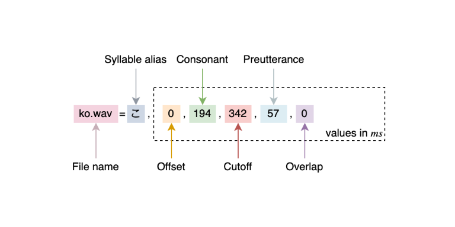

# Glossary of UTAU Tech Terms ✨
This page provides a comprehensive overview of concepts and terms related to UTAU development and its relationship to OpenVBconf.

## Oto.ini
The following parameters can be configured within an `oto.ini` file:

____

#### File name
- Name of the associated wav file. 
- Can be listed multiple times if more than one alias is needed per file. 

#### Syllable alias
- Name of the Note. 

#### Offset
- Start of the sample. 
- Counted from the start of the file. 
- Cannot be negative.

#### Consonant
- Starts at the Offset. 
- Cannot be negative.
- The portion of the sample that isn't stretched/looped by the resampler. 
- The portion of the sample that is affected by Consonant Velocity.

#### Cutoff
- End of the sample. 
- Positive numbers are counted from the end of the file.
- Negative numbers are counted from the Offset. 

#### Preutterance
- Start of the Note. 
- Cannot be negative.
- Everything before this parameter is pushed into the previous Note. 
- Can only push halfway into the previous Note. 

#### Overlap
- Crossfades with the previous Note up to this point. 
- Positive and negative numbers are counted from the Offset. 

## UST files
